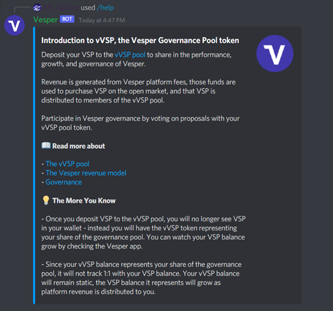
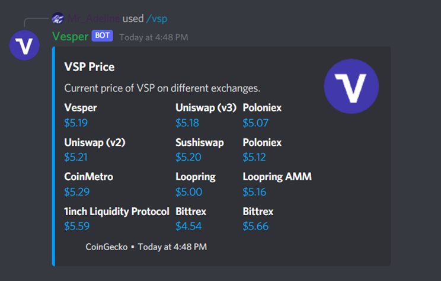
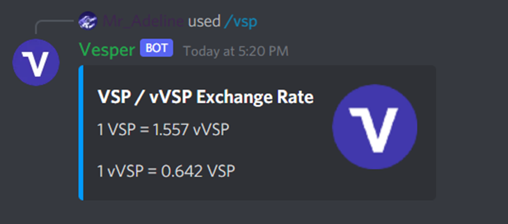

# Official Vesper Discord Bot

Vesper Discord bot lives here. The Discord bot provides various interactive commands for users to use in the official Discord server.

See below for the full list of commands.

## Commands
### /help vvsp

### /vsp price

### /vsp exchange-rate

## External Services
* [Vesper API](https://github.com/vesperfi/doc/blob/main/api/API.md)
* [CoinGecko](https://www.coingecko.com/en/api/documentation)
* [CoinMarketCap](https://coinmarketcap.com/api/)
* [Discord](https://discord.com/developers/docs/intro)
* [Etherscan](https://etherscan.io/apis)

## Storage
Redis is used for storing rate limit data per user and command.

## Contributing
Submit a pull request.

### Running Locally
First you will need to get the correct API keys and fill them into the respective .env files

[Install Redis](https://redis.io/topics/quickstart)
`brew install redis`

[Install Node.js](https://nodejs.org/en/download/)
`brew install node`

[Install Yarn](https://yarnpkg.com/lang/en/docs/install/)
`brew install yarn`

Then run the following commands to install the dependencies
`yarn install`
`yarn start`

### Testing
TODO

## Security
TODO

## Deployment
Staging and Production deploy to Heroku

## License
MIT
